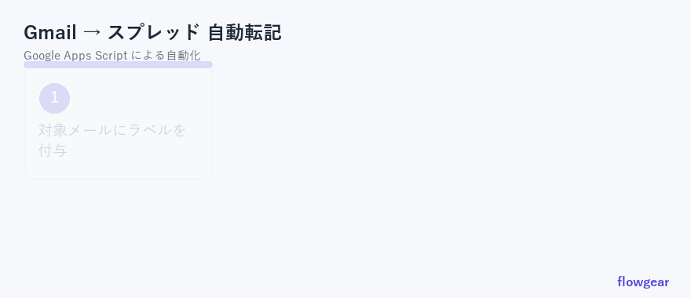
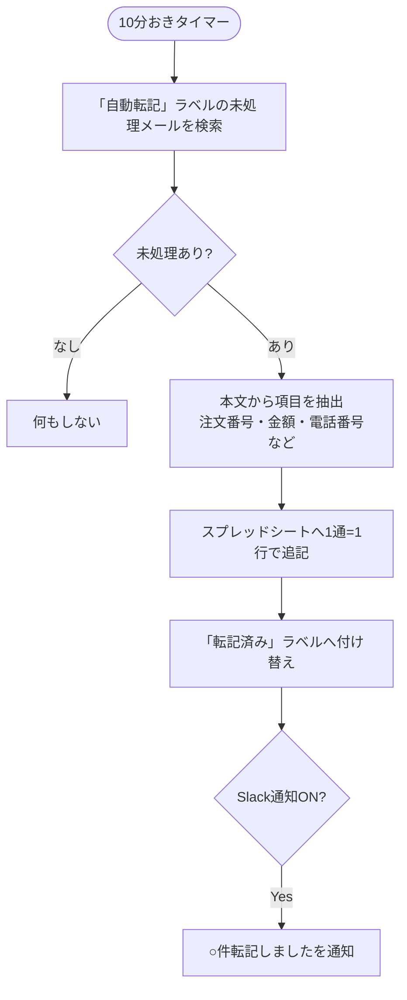

# Gmail 受信メール 自動仕分け＆スプレッド転記システム（Google Apps Script）

注文・問い合わせ・申込などの**受信メールを自動でスプレッドシートに転記**します。
定期的にGmailを確認 → 本文から必要項目（注文番号・金額・電話番号など）を抽出 → シートへ記録 → 処理済みラベルを付与（二重転記なし）。メールの手入力転記から解放されます。
Googleアカウントだけで動き、サーバー費用は **0円**。



---

## できること

| # | 自動でやること | 効果 |
|---|----------------|------|
| 1 | ラベル付きの未処理メールを **定期的に自動チェック**（10分おき） | 「メールを見に行く」が不要に |
| 2 | 本文から **必要項目を抽出**してシートへ転記 | 手入力の転記ミス・抜けを防止 |
| 3 | 処理済みメールに **ラベルを付け替え** | 同じメールを二重転記しない |
| 4 | （任意）**Slackで「○件転記しました」を通知** | 処理状況がひと目で分かる |
| 5 | 失敗時は **管理者へエラー通知** | 静かに止まるのを防ぐ |

> **Before / After** の効果は [`docs/before-after.md`](docs/before-after.md) を参照。

---

## 処理の流れ



---

## 構成

```
gas-gmail-to-sheet/
├── appsscript.json        … プロジェクト設定
├── src/
│   ├── Config.gs          … ★設定はここだけ（ラベル名・抽出ルール・通知）
│   ├── Code.gs            … メイン処理（検索・転記・ラベル付け替え・トリガー登録）
│   ├── Parser.gs          … 本文からの項目抽出（正規表現）
│   └── Common.gs          … エラー通知
├── docs/
│   └── before-after.md    … 導入効果（営業・提案用）
└── sample/
    └── setup.md           … ラベル設定・Gmailフィルタ・抽出ルールの作り方
```

**設計のポイント**
- **抽出ルールを設定化**：取り出したい項目は `Config.gs` に「見出し＋正規表現」で追加するだけ。コード修正不要。
- **二重転記ガード**：処理済みラベルで管理。再実行・障害復旧後も安全。
- **件数上限**：1回の処理件数に上限を設け、実行時間オーバーを回避。
- **サイレント障害対策**：定期実行が失敗したら管理者へ自動通知。

---

## 初期設定（約15分）

### 1. Gmailにラベルを作る
- 処理対象のラベル（既定：`自動転記`）を作成。
- 任意で **Gmailのフィルタ**を作り、対象メール（例：差出人が注文システム、件名に「ご注文」）に自動で `自動転記` ラベルが付くようにすると、完全自動になります。

### 2. スクリプトを貼り付け
転記先にしたいスプレッドシートで `拡張機能 → Apps Script` を開き、`src/` の各ファイルを同名で貼り付け。

### 3. Config.gs を設定
- `TARGET_LABEL` / `DONE_LABEL` … ラベル名（既定のままでも可）
- `PARSE_RULES` … 抽出したい項目を「見出し」と「正規表現」で定義（[`sample/setup.md`](sample/setup.md) に例あり）
- Slack通知を使うなら `SLACK.ENABLED` を `true` にして、スクリプトプロパティ `SLACK_WEBHOOK_URL` を登録

### 4. トリガーを登録
1. 関数 `setupTrigger` を選び ▶ 実行。
2. 初回は権限の承認画面が出るので許可（自分のGoogleアカウント内で動くだけです）。
3. 以後、10分おきに自動でメールを転記します。

### 5. テスト
`自動転記` ラベルを手で1通付けて `processInbox` を手動実行 → シートに行が増え、ラベルが `転記済み` に変わればOK。

---

## よくある質問

**Q. どんなメールでも転記できますか？**
A. 本文がパターン化されたメール（注文確認・申込通知・自動返信など）が得意です。抽出は `PARSE_RULES` の正規表現で調整します。

**Q. 既存の受信メールも対象になりますか？**
A. `自動転記` ラベルを付ければ対象になります。フィルタで「これ以降の受信」に自動付与する運用が安全です。

**Q. 費用はかかりますか？**
A. かかりません（Gmail/スプレッドシートの無料枠で動作）。

---

## ライセンス
MIT License（[LICENSE](LICENSE)）。商用利用・改変可。

---

> このリポジトリはポートフォリオ用のサンプル実装です。実際のメール形式・抽出項目に合わせたカスタマイズや導入支援も承ります。
